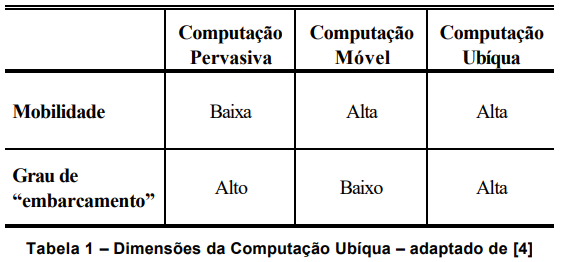

# Interligação em Rede Pervasiva e a internet moderna

É um dos motivos para as mudanças sendo passadas nos sistemas distribuídos.

A Internet moderna é um conjunto de redes de computadores interligadas.
Esta interligação em rede se tornou um recurso pervasivo, e os dispositivos podem ser conectados a qualquer momento e em qualquer lugar.

A Internet é um sistema distribuído muito grande, que permite usuários usarem serviços como World Wide Web, email e transferência de arquivo.  
A função de um firewall é proteger uma intranet, impedindo a entrada ou a saída de mensagens não autorizadas.  
As intranets são interligadas por meio de backbones. Um backbone é um enlace de rede com uma alta capacidade de  transmissão, empregando meios de transmissão.

A implementação da Internet e dos serviços que ela suporta tem acarretado o  desenvolvimento de soluções práticas para muitos problemas dos sistemas distribuídos

## Computação Pervasiva

*Pervasivo: aquilo que se espalha, infiltra ou penetra facilmente algo.*

Avanços tecnológicos na miniaturização de dispositvos e redes tem levado a crescente integração de pequenos dispositivos portáveis (laptops, handheld, sensores, RFIDs).  
A portabilidade e habilidade de se conectar torna possível a Computação Móvel (wearable, embarcados).

Isso traz questões como, a arquitetura para computação móvel:

- Descoberta de recursos em um ambiente
- Eliminar necessidade de reconfiguração
- Auxiliar na conectividade limitada em viagens
- Prover privacidade e segurança

## Resumo

A rede pervasiva é a realidade atual, englobando wearables, e dispositivos conectados de fácil acesso e mobilidade.

As coisas ficaram inteligentes: casa inteligente (domótica), roupas (wearables).  
Tudo começa a ser projetado para ter apoio computacional e expansão no uso.  
As coisas estão conectadas entre si e em rede.  
Objetos estão sensíveis ao toque e aos movimentos do usuário, o corpo passou a ser considerado interface.  
O sistema passou a considerar a realidade ao redor do usuário.  
O GPS embutido no celular, e o resultado da busca na web depende do local e de outras informações contextuais.  
**O digital está aterrado no real**, espalhado ao nosso redor, **tornou-se tão cotidiano e integrado que muitas vezes nem mais notamos** a diferença entre o local e o ciberespaço, entre o real e o virtual; entre o analógico e o digital, entre o off-line e o conectado.  
Vivemos num mundo híbrido.

Pontos a se considerar:

- Informação é acessada por dispositivos heterogeneos
- A aplicação segue o usuário em movimento
- Os dispositivos interagem entre si
- Algumas tarefas são executadas de forma autônoma
- Dispositivos diferentes apresentam visões diferentes da mesma aplicação
- O ambiente troca informações com os dispositivos e vice-versa
- A aplicação responde a mudanças no ambiente

<!-- Dentro disso tem-se alguns exemplos:

- Bueiros conectados, projeto da Net Sensors, que visa controlar o nível de sujeira e usando a informação efeturar o processo de limpeza de forma mais eficiênte
- Projeto de digitalização na ciade de Águas de SP, onde tem-se o estacionamento inteligente, em que lampadas se acendem vermelhas ou verdes caso vagas estejam ocupadas ou livres
- Também em Águas de SP tem o aplicativo "Águas sem dengue" que auxilia agentes da vigilancia no combate ao mosquito - a populaçao pode tirar fotos de possíveis focos e enviar diretamente a base do sistema de saúde -->

Isso gera desafios a sistemas distribuidos principalmente em questões de segurança, privacidade e conectividade.

Além disso tem-se as questões:

- Como mudar de uma rede para outra de forma transparente, sem que isto seja refletido na aplicação?
- Como fazer com que dispositivos “descubram” outros dispositivos ao seu redor e interajam entre si para a realização de serviços?
- Como fazer com que um ambiente inteligente aprenda sobre os dispositivos e as  ações do usuários no ambiente e reflita na aplicação esse contexto aprendido.
- Como projetar aplicações acessadas/executas de/em diferentes dispositivos sem ter que projetar as interfaces e funcionalidades para cada dispositivo separadamente?

  
>Grau de embarcamento: grau de inteligência dos computadores em ambiente pervasivo

**Pervasiva:** Computador tem a capacidade de obter dados do ambiente e controlar, configurar e ajustar a aplicação para melhor atender as necessidades, de forma invisível para o usuário

**Ubíqua:** necessidade de se ntegrar mobilidade com a funcionalidade da computação pervasiva.  
Qualquer dispositivo, enquanto se movimenta conosco pode agir de maneira pervasiva.

Ref:

1. [Caracterização de Sistemas Distribuídos](https://statics-submarino.b2w.io/sherlock/books/firstChapter/116718946.pdf)
2. [Introdução aos Sistemas Distribuídos](https://slideplayer.com.br/slide/3318100/)
3. [(IOT): as consequências da computação ubíqua na sociedade](https://www.google.com/url?sa=t&rct=j&q=&esrc=s&source=web&cd=&cad=rja&uact=8&ved=2ahUKEwjrs87Rlu7yAhV-qJUCHWIrAsYQFnoECCYQAQ&url=https%3A%2F%2Fjournal.unoeste.br%2Findex.php%2Fch%2Farticle%2Fdownload%2F2323%2F2182%2F9377&usg=AOvVaw2-KRxRNulvkI7X3AwBcuTQ)
4. [Computação Ubíqua: Princípios, Tecnologias e Desafios](http://professordiovani.com.br/rw/monografia_araujo.pdf)
5. [1 – Sistemas colaborativos para uma nova sociedade e um novo ser humano](https://sistemascolaborativos.uniriotec.br/sistemas-colaborativos-para-uma-nova-sociedade-e-um-novo-ser-humano/)
